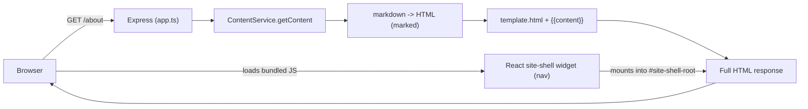

# PensionBee Static Content Challenge

## Overview

This project is a full-stack TypeScript application built as part of PensionBee's technical challenge.

The goal is to dynamically serve HTML pages generated from Markdown files while keeping the application extensible, maintainable and easy to test.

## Architecture

Monorepo with npm workspaces:

| Package    | Stack                        | Port (dev) |
| ---------- | ---------------------------- | ---------- |
| `backend`  | Node.js, Express, TypeScript | 3000       |
| `frontend` | React, Vite, TypeScript      | 5173       |

### Content rendering: server-rendered, not a JSON API

Every route is resolved and rendered entirely by the backend. A `GET` request maps directly onto a folder under `content/`, and the response is a single, fully-formed HTML document — there is no client-side fetch, no hydration step, and no JSON content API involved in producing a page:



- `content/<path>/index.md` → markdown is read, converted to HTML (`marked`), and injected into `template.html`'s `{{content}}` placeholder. New folders under `content/` are picked up automatically — no code changes or redeploys needed to publish a new page.
- Path traversal (`..`, `.`), trailing slashes, and missing files are all handled by [`backend/src/services/contentService.ts`](backend/src/services/contentService.ts) and covered by isolated fixture-based tests (they don't depend on the real `content/` folder, so tests stay stable as content changes).

**Why not a SPA + JSON API?** The brief asks for pages to be returned "at URLs that match the paths of the folders" — i.e. the response to `GET /about` should already be the rendered page, not a shell that fetches content afterwards. Server-rendering also keeps the app trivially testable with `supertest` (a plain HTTP assertion on `res.text`, no browser/JS execution required) and avoids SEO/first-paint trade-offs a client-rendered CMS would introduce for what is fundamentally static marketing content.

**Where React fits in:** the brief requires React on the front-end "to fit in with Acme Co's other websites," but doesn't ask for React to be the rendering engine. React is used as a small, optional **progressive-enhancement widget** — a site shell (nav/branding, mobile menu) built with Vite and mounted client-side into a placeholder in `template.html`. It never gates the page's core content: if the script fails to load, the server-rendered markdown is still there and correct.

**Testing:** Backend tests use Vitest and Supertest, with fixtures isolated from the runtime `content/` directory (`backend/src/**/__tests__/fixtures/`) so tests don't break as real content changes.

## Prerequisites

- Node.js 20+
- npm 10+

## Setup

```bash
npm install
```

## Development

```bash
npm run dev
```

This starts the backend (with the site-shell widget rebuilding on change) at **http://localhost:3000** — that's the one and only URL you should browse. There's no separate frontend server to visit: the backend serves the fully rendered pages, and the React widget ships as a static asset that mounts itself client-side. A request to a content route (`/about`, `/blog/...`) returns the final page directly — no redirects, no client-side routing.

If you want to iterate on the `SiteShell` component in isolation with hot-reload (a nice-to-have for UI tweaks, not part of the main workflow), run:

```bash
npm run dev:widget-preview
```

This opens a throwaway Vite dev harness at http://localhost:5173 that renders the component standalone — it has no routes, no content, and isn't part of the shipped app.

## Testing

```bash
npm test
```

Or per package:

```bash
npm test -w backend
npm test -w frontend
```

## Build

```bash
npm run build
```

Produces `frontend/dist/` and `backend/dist/`.

Start the compiled backend:

```bash
npm start -w backend
```

## Linting & formatting

```bash
npm run lint
npm run format
npm run format:check
```

## CI

GitHub Actions runs on every pull request and on pushes to `main`. Workflow: [`.github/workflows/ci.yml`](.github/workflows/ci.yml).

Steps:

1. `npm ci`
2. `npm run lint`
3. `npm test`
4. `npm run build`

Run the same checks locally before pushing:

```bash
npm run ci
```

Results appear under the **Actions** tab and in pull request checks.

## Project structure

```
.
├── content/               # Markdown content (runtime)
├── template.html          # HTML shell for server-rendered pages
├── backend/
│   └── src/
│       ├── app.ts         # Express app factory (testable)
│       ├── index.ts       # Server entry point
│       └── __tests__/
├── frontend/
│   └── src/
├── .github/workflows/     # CI pipeline
└── package.json           # Workspace root
```

## Roadmap

- Implement dynamic markdown content resolution
- Convert Markdown to HTML
- Inject rendered HTML into the template
- Serve the React production build from Express
- Add comprehensive automated tests
